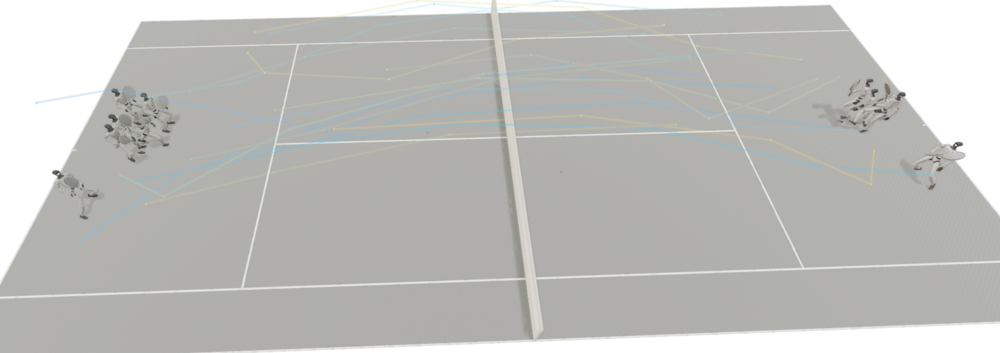

# Humanoid Tennis

## Introduction
This project uses `mjlab` to train a Unitree G1 humanoid robot to play tennis. The Python package name is `humanoid_tennis`, and the repository contains the reinforcement learning pipeline, tennis task design, rollout utilities, and policy export scripts. The training curriculum is organized into three stages:
1. **Stage 1 (Motion Tracking)**: The robot learns to robustly track diverse reference motions.
2. **Pulse Stage**: A distillation/compression phase where the robot's capabilities are encoded into a latent "Pulse" representation.
3. **High-Level Task**: The robot utilizes the learned latent space to solve the dynamic task of intercepting and hitting a tennis ball over the net.

## Installation
This project uses `uv` for fast Python package management. To install all necessary dependencies, simply run:

```bash
uv sync
```

## Sim2Real Deployment

The sim2real deployment and sim-to-sim assets live in a separate repository:

https://github.com/aoru45/tennis_deploy_sim2real

This repository references it as the `sim2real` git submodule. Initialize it when deployment-side code is needed:

```bash
git submodule update --init --recursive sim2real
```

## Training

The training process follows a three-stage curriculum. You must complete each stage sequentially as the subsequent stages depend on the learned weights from the previous ones.

### 1. Train Low-Level Motion Tracking (Stage 1)
First, train the base policy to track reference motions.
```bash
./train_track.sh
```

### 2. Train Pulse (Latent Representation)
Once the base policy is trained, run the Pulse training stage to compress the skills into a manageable latent space.
*(Make sure to update the `teacher_checkpoint_path` in your config to point to the Stage 1 output before running).*
```bash
./train_pulse.sh
```

### 3. Train High-Level Task (Tennis)
Finally, train the high-level policy to play tennis using the pre-trained Pulse models.
*(Make sure to update the `teacher_checkpoint_path` or relevant checkpoint paths in your highlevel config to point to the Pulse output).*
```bash
./train_highlevel.sh
```

## Acknowledgements

This project is inspired by the LATENT project from Galaxy General Robotics, Tsinghua University, and Galbot:

https://github.com/GalaxyGeneralRobotics/LATENT
